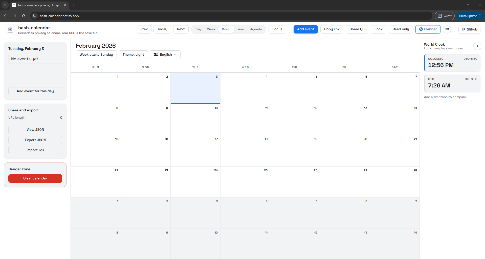

<p align="center">
  
</p>

# hash-calendar

`hash-calendar` is a privacy-first, client-only calendar.  
Your data lives in the URL hash, so sharing is just copying a link.

Live site: https://hash-calendar.netlify.app/  
GitHub: https://github.com/supunlakmal/hash-calendar

## Highlights

- Multi-language UI (English, Sinhala, Tamil, Italian)
- Mobile drawer menu with quick icon actions
- World Planner modal (multi-timezone planning grid with scrubber and 12h/24h toggle)
- App launcher menu in the top bar
- PWA support (manifest + service worker cache)
- JSON bridge page (`json.html`) for raw JSON -> hash URL redirect
- Direct-link event creation from human-readable URL paths

## Features

### Calendar and planning

- Day, week, month, year, and agenda views
- Create, edit, delete, recurring, all-day, and cross-day timed events
- Color palette support and editable calendar title
- Focus mode overlay with timer and upcoming list
- "Up Next" countdown widget

### Read-only mode

- Dedicated read-only toggle (switch between edit and read-only)
- In read-only mode, edit-heavy controls are hidden on desktop and mobile:
  - Add event actions
  - Add world-clock/timezone actions
  - Share and export section
  - Danger zone section
- Read-only state is saved in the URL hash (`s.r`) so shared links open with the same mode

### Share and portability

- URL-hash state with LZ-String compression
- Copy-link and QR share (with URL length guard)
- View/copy JSON and raw hash from modal
- Export JSON
- Import `.ics` (supports daily/weekly/monthly/yearly RRULE frequency mapping)
- One-time import from readable URL path or hash-path, then auto-save to compressed hash

### Timezone tools

- World Clock sidebar with saved zones
- Timezone search by city/region or UTC offset
- World Planner with timezone comparison grid

### Privacy and security

- Optional password lock using AES-GCM + PBKDF2 (150k iterations, SHA-256)
- Encrypted links start with `#ENC:`
- No backend, no accounts, no server-side storage
- Analytics is configured to avoid sending URL hash data

### UX and platform

- Theme toggle (light/dark)
- Week start toggle (Sunday/Monday)
- URL length meter + warning
- Mobile hamburger drawer + quick action buttons
- Installable PWA with offline caching of app assets

## Screenshots

<table>
  <tr>
    <td></td>
    <td></td>
  </tr>
  <tr>
    <td></td>
    <td></td>
  </tr>
  <tr>
    <td></td>
    <td></td>
  </tr>
  <tr>
    <td></td>
    <td></td>
  </tr>
  <tr>
    <td></td>
    <td></td>
  </tr>
  <tr>
    <td></td>
    <td></td>
  </tr>
</table>

## Getting started

Open `index.html` directly, or run a local server:

```bash
npx serve .
```

Alternative:

```bash
python -m http.server 8080
```

## Docker run

```bash
docker compose up --build
```

Default ports are `80` and `443` (override with `HOST_PORT_HTTP` / `HOST_PORT_HTTPS`).

## JSON bridge (`json.html`)

Use `json.html` to pass JSON payloads via query params (`json`, `data`, `state`, `payload`) and auto-redirect to a compressed hash URL.

## Direct-link event creation (readable URL paths)

You can create events directly from the URL path. The app parses readable paths from either:

- `window.location.pathname` (e.g. `/2025/12/25/10/30/Open-Presents`)
- A hash-path beginning with `/` (e.g. `#/2025/12/25/10/30/Open-Presents`)

Supported patterns:

| Pattern | Scenario | Example |
| :-- | :-- | :-- |
| `YYYY/MM/DD/HH/mm/Title` | Full precision | `/2025/12/25/10/30/Open-Presents` |
| `YYYY/MM/DD/Title` | All-day | `/2025/12/25/Christmas-Day` |
| `YYYY/MM/DD/HH/mm+Minutes/Title` | Timed with explicit duration | `/2025/12/25/10/00+90/Family-Brunch` |
| `Event1,Event2` | Multi-event in one link | `/2025/01/01/Gym,2025/01/01/10/00/Clean` |

Behavior notes:

- URL segments are decoded (`decodeURIComponent`), and dashes in titles become spaces.
- If title is missing, it falls back to `New Event (URL)`.
- Parsed events are appended once, then the readable path is cleaned and state is persisted as the normal compressed URL hash.

## How it works

1. State is serialized to JSON.
2. JSON is compacted and compressed into the URL hash.
3. Optional password encryption wraps the compressed payload.
4. Opening the link restores the full calendar state in-browser.

If there is no non-default calendar data (events, saved timezones, or changed settings), the hash is cleared automatically.

## URL hash payload (compact schema)

Example (before compression):

```json
{
  "t": "Acme Schedule",
  "c": { "1": "2ecc71", "3": "e74c3c" },
  "e": [
    [28930080, 30, "Daily standup", 1, "d"],
    [28930200, 0, "Launch day", 3],
    [28930800, 90, "Design review"]
  ],
  "s": { "d": 1, "m": 1, "v": "week", "l": "en", "r": 1 },
  "mp": {
    "h": "America/Los_Angeles",
    "z": ["UTC", "Asia/Tokyo", "Europe/London"],
    "s": 1769721600000,
    "d": "2026-01-30",
    "f24": 1
  }
}
```

Key fields:

- `t`: title
- `c`: color overrides by palette index (hex without `#`)
- `e`: events as `[startMin, duration, title, colorIndex?, recurrence?]`
- `s`: settings (`d` theme, `m` week start, `v` last view, `l` language, `r` read-only mode)
- `mp`: optional world-time snapshot (`h` home zone, `z` saved zones, `s` scrubber timestamp, `d` planner date, `f24` 24-hour mode)

Recurrence values: `d` (daily), `w` (weekly), `m` (monthly), `y` (yearly)

Legacy compatibility: older payloads with top-level `z` / `timezones` / `tz` are still read and migrated into `mp.z`.

## Project structure

- `index.html` - main app UI
- `script.js` - app state, events, rendering orchestration
- `json.html` - JSON payload bridge page
- `styles.css`, `styles-i18n.css`, `styles-logo.css` - styles
- `sw.js`, `manifest.json` - PWA setup
- `locales/` - translation dictionaries
- `modules/`
  - `calendarRender.js` - month/week/day/year rendering
  - `agendaRender.js` - agenda rendering
  - `constants.js` - shared app constants
  - `recurrenceEngine.js` - recurrence expansion
  - `countdownManager.js` - "Up Next" widget
  - `focusMode.js` - focus overlay
  - `timezoneManager.js` - timezone helpers
  - `worldPlannerModule.js` - world planner modal logic
  - `qrCodeManager.js` - QR modal logic
  - `icsImporter.js` - `.ics` parser
  - `hashcalUrlManager.js` - compact/read/write hash state
  - `cryptoManager.js` - encryption/decryption helpers
  - `i18n.js` - localization engine
  - `app_launcher.js` - app launcher menu
  - `urlPathEventParser.js` - readable URL path parser for event creation
  - `lz-string.min.js` - compression library
- `demo/` - screenshot assets
- `Dockerfile`, `docker-compose.yaml`, `Caddyfile` - containerized deployment

## License

MIT. See `LICENSE`.
